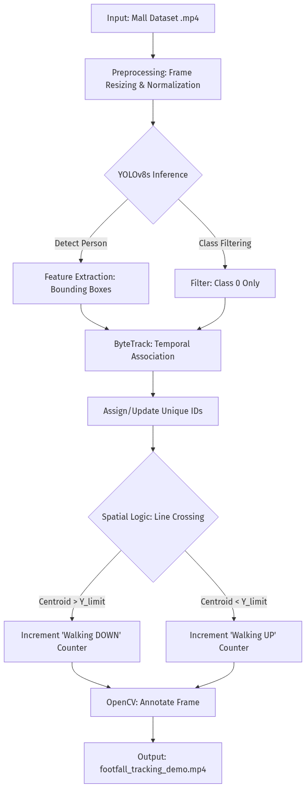
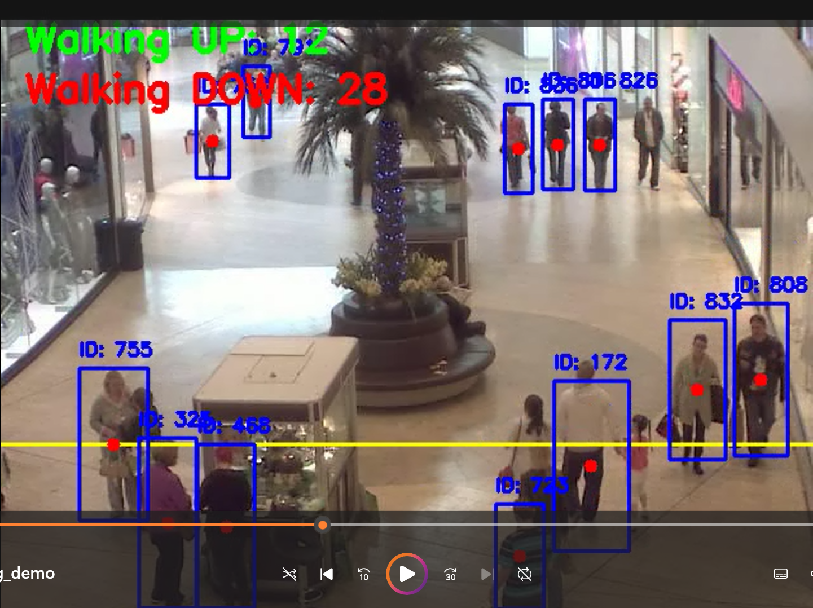

# 🛒 Retail Analytics & Footfall Tracking

[](https://www.python.org/downloads/)
[](https://docs.ultralytics.com/)
[](https://github.com/ifzhang/ByteTrack)

<p align="center">
  
</p>

## 📌 Overview
Physical retail spaces often lack the accessible, data-driven insights common in e-commerce. This project bridges that gap by utilizing Computer Vision to create a lightweight, automated footfall counter. 

By processing standard security camera footage, the system tracks individuals, assigns unique IDs, and counts them as they cross a virtual threshold. This transforms raw video into actionable data for store operations.

## 🏗️ System Architecture
The system follows a modular computer vision pipeline, transitioning from raw pixel data to structured retail analytics.



**Key Components:**
* **Inference:** YOLOv8s processes frames at 640x640 resolution to identify "Person" instances.
* **Tracking:** ByteTrack associates detections across frames using a Kalman Filter to maintain persistent IDs.
* **Analytics:** A spatial trigger monitors the Y-centroid of each ID relative to a virtual threshold to register crossing events.

## 💼 Business Impact
* **Operations:** Identifies peak hours to optimize staff scheduling.
* **Marketing ROI:** Measures changes in store traffic during specific promotional campaigns.
* **Cost-Effective:** Provides high-value analytics using existing CCTV infrastructure.

## 📊 Experimental Results
The model was evaluated using the **Mall Dataset**, simulating a high-density retail environment.

* **Processing Speed:** ~30 FPS (Google Colab T4 GPU)
* **Detection Accuracy:** High precision in crowded scenes with minimal ID-switching.

### Real-Time Tracking Output


**Final Count (Test Sequence):**
* **Walking UP:** 12
* **Walking DOWN:** 28

## 🛠️ Installation & Setup

1. **Clone the repository:**
   ```bash
   git clone https://github.com/arukima12/Retail-Analysis-and-footfall-tracking.git
   cd Retail-Analysis-and-footfall-tracking
